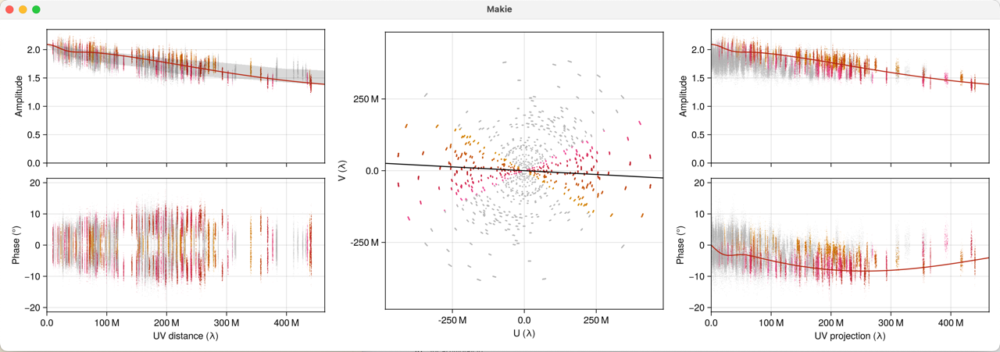

# UV Visualization

Display and interactively inspect your data and model in the visibility domain.

Supports `UV FITS` files for visibilities, and `Difmap`-style model files.

# Usage

- Install Julia 1.10
- Start `julia --project` in this directory
- Run `include("uvvis.jl")`
  - When run for the first time, wait until all dependencies are installed
- Execute `uvvis("path to uvfits file", "path to difmap model file (optional)")`

# Examples

